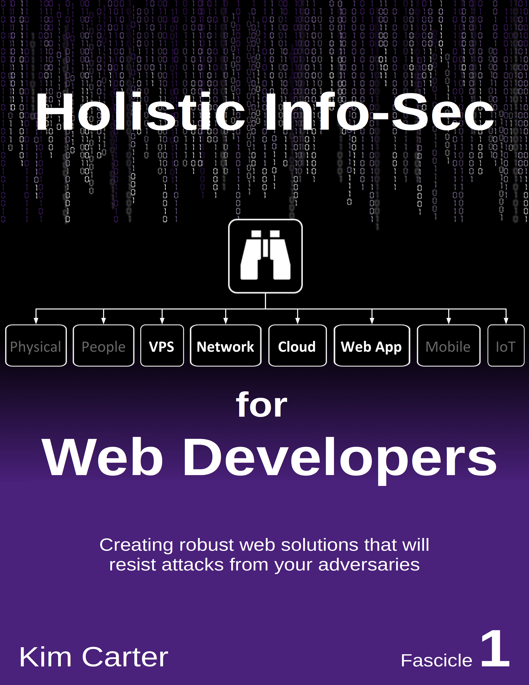

# Holistic InfoSec For Web Developers
## Fascicle 1

The contents of Fascicle 1 which is content complete and in technical review, can be found at the books [landing page](https://f1.holisticinfosecforwebdevelopers.com/).

The entire book series can be found [here](https://holisticinfosecforwebdevelopers.com/) at [www.holisticinfosecforwebdevelopers.com](https://holisticinfosecforwebdevelopers.com/)

 

 

## Table of Contents (in source)

* [Foreward](manuscript/markdown/front/foreword.md)
* [Preface](manuscript/markdown/front/preface.md)
* [Introduction](manuscript/markdown/front/introduction.md)
* [Chapter 7: VPS](manuscript/markdown/main/chapter7.md)
* [Chapter 8: Network](manuscript/markdown/main/chapter8.md)
* [Chapter 9: Cloud](manuscript/markdown/main/chapter9.md)
* [Chapter 10: Web App](manuscript/markdown/main/chapter10.md)
* [Additional Resources](manuscript/markdown/back/additional-resources.md)
* [Attributions](manuscript/markdown/back/attributions.md)

